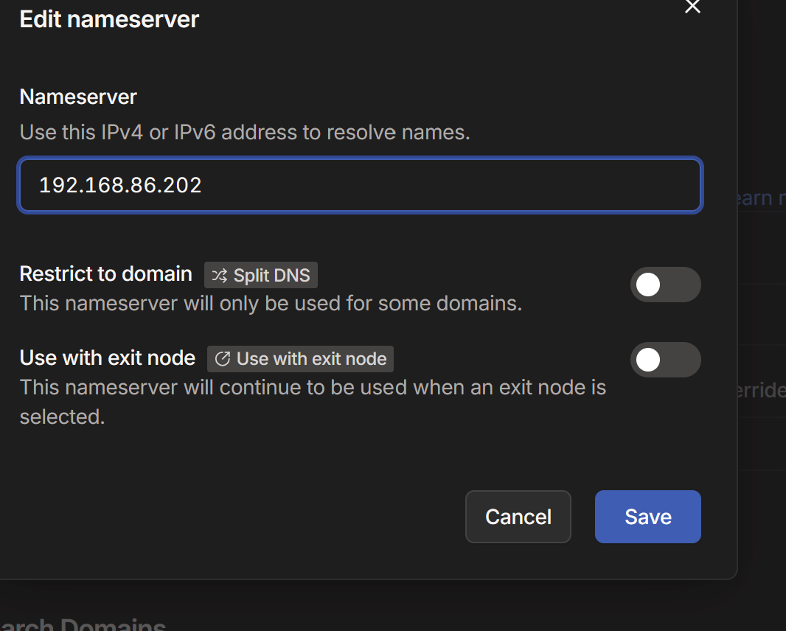

## Work Completed

### Pi-hole — Network-Wide DNS Rollout

Goal: finish the last step of the Pi-hole project — actually pointing the home network's DNS at Pi-hole, verifying it works both at home and remotely, and closing the project out.

* Got Google Wifi/Google Home admin access from brother, unblocking the final DNS step
* Google Wifi's DNS was already custom-configured (primary `8.8.8.8`, secondary `8.8.4.4`); changed primary to `192.168.86.202` (Pi-hole) and kept `8.8.4.4` as secondary — see [8.8.4.4 Secondary DNS over Blank Fallback for Pi-hole](../Decisions/8.8.4.4%20Secondary%20DNS%20over%20Blank%20Fallback%20for%20Pi-hole.md)
* Google Wifi required a valid IPv6 DNS entry to save the custom config; disabled IPv6 on the network entirely instead of using a public IPv6 fallback — see [Disabling IPv6 over Public IPv6 DNS Fallback for Google Wifi Custom DNS](../Decisions/Disabling%20IPv6%20over%20Public%20IPv6%20DNS%20Fallback%20for%20Google%20Wifi%20Custom%20DNS.md)
* The `tailscaleproxy` VM (subnet router/exit node) briefly dropped offline right as the DNS switch took effect, but came back on its own within a couple of days with the new DNS config active

#### Troubleshooting

* Tested ad blocking on a movie-streaming site — popups/redirects still got through, which looked like a failure but wasn't — [DNS-Level Blocking Ineffective Against Streaming-Site Popup and Redirect Ads](../Troubleshooting/DNS-Level%20Blocking%20Ineffective%20Against%20Streaming-Site%20Popup%20and%20Redirect%20Ads.md)
* Remote testing via the Tailscale exit node showed no ad blocking at all on either phone or laptop — [Tailscale Exit Node Not Overriding Client DNS to Pi-hole](../Troubleshooting/Tailscale%20Exit%20Node%20Not%20Overriding%20Client%20DNS%20to%20Pi-hole.md)

### Result

* Pi-hole dashboard confirmed healthy: steady query volume, ~9.9% block rate, 93,516 domains on the active list

*Pi-hole dashboard after the network-wide DNS switch, showing steady query volume and blocking activity.*

* Verified network-wide ad blocking working both from the home LAN and remotely via the Tailscale exit node, after fixing the DNS-override settings in the Tailscale admin console

*Tailscale admin console DNS page — 192.168.86.202 set as nameserver with "Override DNS servers" and "Use with exit node" both enabled.*

## Status

* Pi-hole network-wide ad blocking is complete and verified end-to-end, both at home and remotely
* Unbound (recursive resolver add-on) remains deferred as a future project

## Next Steps

1. Decide on the next homelab project from the candidate rotation (helpdesk, sysadmin/AD, networking/pfSense, cybersecurity/SIEM, cloud), given about a month left until the career fair
2. Revisit Unbound for Pi-hole at some point as a smaller follow-up project
