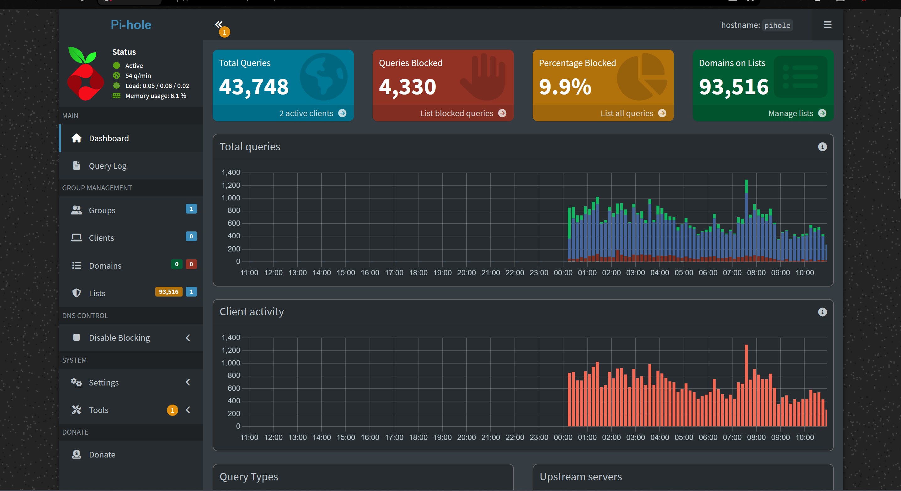

## Goal

Network-wide, DNS-based ad blocking for the entire home network — both on the home LAN and for devices connecting remotely via Tailscale.

## LXC Container

### Pi-hole (pihole / VMID 102)

Specs: Unprivileged LXC, Debian 13, 1 core, 512MB RAM, 2GB disk, static IP `192.168.86.202/24` (see [Static IP over DHCP Reservation](../Decisions/Static%20IP%20over%20DHCP%20Reservation.md)), gateway `192.168.86.1`, IPv6 disabled, FUSE and TUN/TAP both disabled.

Deployed via the Proxmox Community Scripts one-liner installer rather than building the LXC manually — see [Proxmox Community Scripts over Manual LXC Creation for Pi-hole](../Decisions/Proxmox%20Community%20Scripts%20over%20Manual%20LXC%20Creation%20for%20Pi-hole.md).

## Build

Hit a run of unrelated tooling issues getting the install to actually complete:

- Pasting the install command into the noVNC console produced corrupted input — [Bracketed-Paste Corruption in Proxmox noVNC Console](../Troubleshooting/Bracketed-Paste%20Corruption%20in%20Proxmox%20noVNC%20Console.md)
- Keypresses stopped registering at a couple of points, in both the noVNC console and a PowerShell SSH session — accidental text selection freezing input — [QuickEdit Mode and noVNC Selection Freezing Console Input](../Troubleshooting/QuickEdit%20Mode%20and%20noVNC%20Selection%20Freezing%20Console%20Input.md)
- Recurring `curl: Could not resolve host: raw.githubusercontent.com` failures mid-install — a known, transient issue with these community scripts generally — [raw.githubusercontent.com Intermittent DNS Resolution Failures](../Troubleshooting/raw.githubusercontent.com%20Intermittent%20DNS%20Resolution%20Failures.md)
- Piping the install script straight into `bash` silently swallowed an interactive confirmation prompt, auto-aborting the container each time — [Piped Install Script Swallowing Interactive Confirmation Prompt](../Troubleshooting/Piped%20Install%20Script%20Swallowing%20Interactive%20Confirmation%20Prompt.md)
- `pct exec` couldn't find the `pihole` binary by name even though it existed — a `PATH` issue, not a missing install — [pct exec Not Resolving Binary via PATH](../Troubleshooting/pct%20exec%20Not%20Resolving%20Binary%20via%20PATH.md)
- Declined the installer's optional Unbound add-on for now — [Unbound Deferred as a Separate Follow-Up Project](../Decisions/Unbound%20Deferred%20as%20a%20Separate%20Follow-Up%20Project.md)

Result: Pi-hole fully installed and confirmed working end-to-end (`pihole status`, admin dashboard reachable at `http://192.168.86.202/admin`). Blocklist populated automatically during install (StevenBlack/hosts, ~76,000 domains). Admin password set via `pihole setpassword`.

## Network-Wide DNS Rollout

Blocked initially on router access — the home network runs a Spectrum modem paired with Google Wifi as the actual router/mesh, managed under the brother's Google account while he was out of town. Confirmed Google Wifi/Google Home management is fully cloud-based, so physical presence wasn't required to grant access.

Once access was granted:

- Google Wifi's DNS was already custom-configured (primary `8.8.8.8`, secondary `8.8.4.4`). Changed primary to `192.168.86.202` (Pi-hole), kept `8.8.4.4` as secondary rather than leaving it blank — see [8.8.4.4 Secondary DNS over Blank Fallback for Pi-hole](../Decisions/8.8.4.4%20Secondary%20DNS%20over%20Blank%20Fallback%20for%20Pi-hole.md)
- Google Wifi required a valid IPv6 DNS entry to save the custom config; disabled IPv6 on the network entirely instead of using a public IPv6 fallback, to close a potential DNS bypass path — see [Disabling IPv6 over Public IPv6 DNS Fallback for Google Wifi Custom DNS](../Decisions/Disabling%20IPv6%20over%20Public%20IPv6%20DNS%20Fallback%20for%20Google%20Wifi%20Custom%20DNS.md)
- The `tailscaleproxy` VM briefly dropped offline right as the DNS switch took effect, but came back on its own within a couple of days with the new DNS config active

## Verification

- Testing against a movie-streaming site showed popups/redirects still getting through — looked like a failure but wasn't, since that style of ad isn't delivered via a blockable DNS lookup — [DNS-Level Blocking Ineffective Against Streaming-Site Popup and Redirect Ads](../Troubleshooting/DNS-Level%20Blocking%20Ineffective%20Against%20Streaming-Site%20Popup%20and%20Redirect%20Ads.md)
- Remote testing via the Tailscale exit node initially showed no ad blocking at all — the exit node doesn't override client DNS by itself; that's a separate setting — [Tailscale Exit Node Not Overriding Client DNS to Pi-hole](../Troubleshooting/Tailscale%20Exit%20Node%20Not%20Overriding%20Client%20DNS%20to%20Pi-hole.md) (fix detailed in [Tailscale](Tailscale.md))
- Final dashboard check confirmed healthy: steady query volume, ~9.9% block rate, 93,516 domains on the active list

*Pi-hole dashboard after the network-wide DNS switch, showing steady query volume and blocking activity.*

## Status

Complete and verified end-to-end — network-wide ad blocking working both on the home LAN and remotely via the Tailscale exit node.

## Related Decisions

- [Proxmox Community Scripts over Manual LXC Creation for Pi-hole](../Decisions/Proxmox%20Community%20Scripts%20over%20Manual%20LXC%20Creation%20for%20Pi-hole.md)
- [Unbound Deferred as a Separate Follow-Up Project](../Decisions/Unbound%20Deferred%20as%20a%20Separate%20Follow-Up%20Project.md)
- [8.8.4.4 Secondary DNS over Blank Fallback for Pi-hole](../Decisions/8.8.4.4%20Secondary%20DNS%20over%20Blank%20Fallback%20for%20Pi-hole.md)
- [Disabling IPv6 over Public IPv6 DNS Fallback for Google Wifi Custom DNS](../Decisions/Disabling%20IPv6%20over%20Public%20IPv6%20DNS%20Fallback%20for%20Google%20Wifi%20Custom%20DNS.md)
- [Static IP over DHCP Reservation](../Decisions/Static%20IP%20over%20DHCP%20Reservation.md)

## Project Log

### 2026-07-14

- Built the Pi-hole LXC via Community Scripts, resolved five unrelated tooling issues along the way, confirmed working locally
- Blocked on router access for the network-wide DNS switch — [Daily Log — 2026-07-14](../Daily%20Logs/2026-07-14.md)

### 2026-08-26

- Got Google Wifi access, pointed the network's DNS at Pi-hole, disabled IPv6 to close a bypass path
- Verified ad blocking working both locally and remotely — [Daily Log — 2026-08-26](../Daily%20Logs/2026-08-26.md)

## Next Steps

1. Revisit Unbound (recursive DNS resolver) as a smaller follow-up project — see [Unbound Deferred as a Separate Follow-Up Project](../Decisions/Unbound%20Deferred%20as%20a%20Separate%20Follow-Up%20Project.md)
