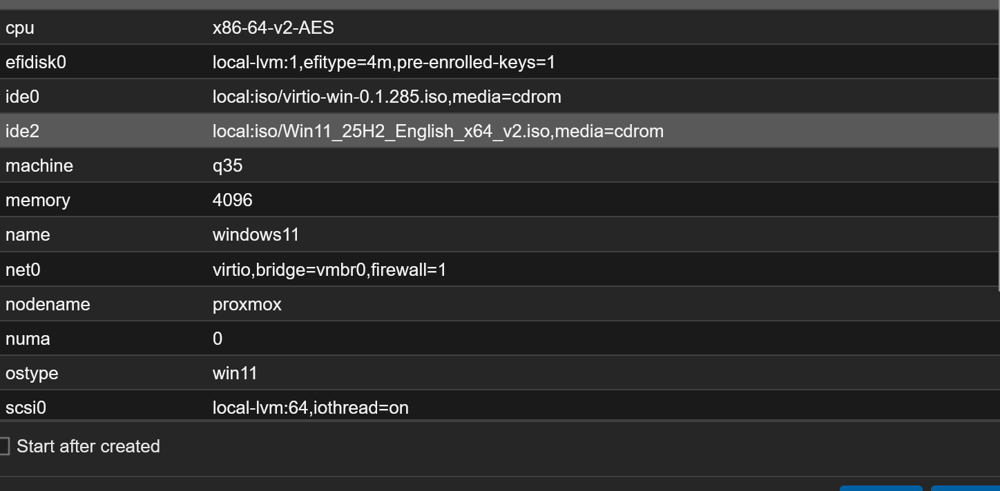
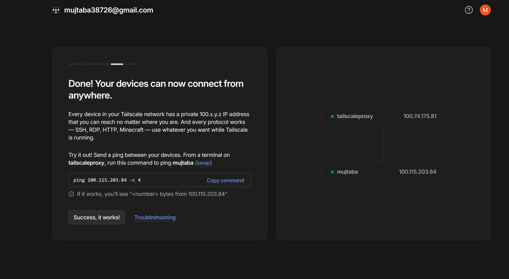

## Goal

Build a virtualization environment for learning IT infrastructure.

## Hardware

- Lenovo ThinkCentre M720q
- CPU: Intel i5-8400T
- RAM: 16GB
- Storage: 500GB SSD

## Planned Skills

- Virtualization
- Linux Administration
- Docker
- Networking
- Active Directory
- Security Monitoring
- Remote Access

## Virtual Machines

### Windows 11 (windows11 / VMID 100)

Status: Installed, unactivated (see [[Windows Practice VM - Left Unactivated]]), currently shut down. Practice/learning VM, not daily-use.

Specs: q35 machine, OVMF (UEFI), TPM v2.0, VirtIO SCSI disk (64GB), VirtIO NIC, 4096MB RAM, 2 cores.

*Final hardware config before first boot.*

### Ubuntu Server / Tailscale Proxy (tailscaleproxy / VMID 101)

Purpose: general remote access to home infrastructure (subnet router), and an exit node so specific devices (brother's Google TV, personal iPhone) can share the home IP for a Stremio + Real-Debrid setup (see [[Tailscale Exit Node over Dante Proxy for Stremio-RD]], supersedes [[Tailscale Proxy Approach for Stremio-RD]]).

Status: Installed, running. Static IP 192.168.86.201 (see [[Static IP over DHCP Reservation]]), Tailscale IP 100.74.175.81, hostname `tailscaleproxy`. Advertised and approved as both a subnet router (192.168.86.0/24) and an exit node. Dante SOCKS5 proxy also installed and confirmed working (port 1080), though not the path currently used for Stremio sharing.

Specs: SeaBIOS, i440fx machine, VirtIO SCSI disk (20GB), VirtIO NIC, 2048MB RAM, 1 core.

*Ubuntu VM and Windows machine both joined to the same tailnet, connectivity confirmed via ping.*

### Windows Server (planned, not yet built)

Purpose:

- Active Directory
- DNS
- Group Policy

## Status

Proxmox installed and running. Two VMs built (Windows 11 practice VM, Ubuntu Tailscale proxy VM). Tailscale connectivity confirmed working between the Ubuntu VM and the Windows management machine.

## Related Decisions

- [[Filesystem - ext4+LVM over ZFS]]
- [[Static IP over DHCP Reservation]]
- [[Claude Desktop - Filesystem MCP over Code Tab]]
- [[Windows Practice VM - Left Unactivated]]
- [[Tailscale Proxy Approach for Stremio-RD]]
- [[Vault Separation - Homelab vs Life]]

## Project Log

### 2026-06-04

- Purchased Lenovo ThinkCentre M720q
- Installed Obsidian
- Created documentation vault
- Connected vault to GitHub
- Configured Obsidian Git
- Verified synchronization between M720q and ASUS laptop

### 2026-07-11

- Completed pre-installation checklist: BIOS virtualization settings (VT-x, VT-d), Secure Boot disabled, UEFI-only confirmed
- Linked Windows OEM digital license to Microsoft account and saved product key as backup
- Planned network configuration: static IP 192.168.86.200/24, verified unused via arp -a (see [[Static IP over DHCP Reservation]])
- Decided on ext4+LVM over ZFS (see [[Filesystem - ext4+LVM over ZFS]])
- Verified Proxmox VE 9.2-1 ISO checksum before installation
- Resolved USB boot failure and post-install connectivity issue (see [[Proxmox Installation - USB Boot and Network Connectivity Issues]])
- Successfully installed Proxmox VE 9.2-1
- Confirmed web UI access at [https://192.168.86.200:8006](https://192.168.86.200:8006)
- Updated packages, switched to no-subscription repo

### 2026-07-12

- Set up Claude Desktop filesystem MCP integration to read/write directly into this vault (see [[Claude Desktop - Filesystem MCP over Code Tab]])
- Built Windows 11 practice VM (VMID 100) — see [[2026-07-12]] for full detail on driver loading, activation issue, and backup restore; activation decision in [[Windows Practice VM - Left Unactivated]]
- Built Ubuntu Server VM (VMID 101) for Tailscale — static IP 192.168.86.201
- Installed and authenticated Tailscale on the Ubuntu VM and on the Windows management machine, joining both to the same tailnet
- Confirmed working connectivity between both devices over Tailscale (ping test successful)
- Clarified requirement for the Stremio/RD use case — see [[Tailscale Proxy Approach for Stremio-RD]]

## Next Steps

1. Install and configure a SOCKS5/HTTP proxy service on the Ubuntu Tailscale VM
2. Point Stremio's proxy settings at the VM's Tailscale IP
3. Add friends' devices to the tailnet so they can reach the proxy remotely
4. Continue toward planned roadmap: Docker → Active Directory → Monitoring → Wazuh
