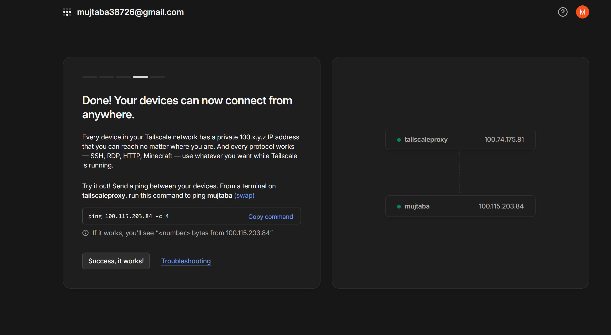

## Goal

General remote access to home infrastructure from anywhere (subnet router), and a way to share the home IP with two specific outside devices (brother's Google TV, personal iPhone) for a Stremio + Real-Debrid setup, without exposing every device's full traffic unnecessarily.

## Virtual Machine

### Ubuntu Server / Tailscale Proxy (tailscaleproxy / VMID 101)

Specs: SeaBIOS, i440fx machine, no TPM (not needed for Linux), VirtIO SCSI disk (20GB), VirtIO NIC, 2048MB RAM, 1 core. Static IP `192.168.86.201` (see [Static IP over DHCP Reservation](../Decisions/Static%20IP%20over%20DHCP%20Reservation.md)), Ubuntu Server 26.04 LTS, OpenSSH installed during setup.

Managed via SSH from the management laptop rather than Proxmox's noVNC console — see [SSH over Proxmox Console for Linux VM Management](../Decisions/SSH%20over%20Proxmox%20Console%20for%20Linux%20VM%20Management.md).

## Build

- Installed Tailscale on the VM and authenticated it to the tailnet (Tailscale IP `100.74.175.81`, hostname `tailscaleproxy`)
- Installed Tailscale on the personal laptop (`mujlaptop`, `100.115.203.84`) and later on the Windows 11 practice VM (`100.76.5.113`) — the two were initially mixed up in the first day's log and corrected the next day
- Verified connectivity end-to-end via ping between tailnet devices

## Subnet Routing

Goal: reach the entire home LAN remotely via Tailscale, not just individually-joined devices.

- Confirmed LAN subnet on the Ubuntu VM: gateway `192.168.86.1`, subnet `192.168.86.0/24`
- Enabled IP forwarding and advertised the home subnet (`sudo tailscale up --advertise-routes=192.168.86.0/24`)
- Approved the advertised route for `tailscaleproxy` in the Tailscale admin console
- Verified end-to-end from the personal laptop (`ping 192.168.86.200`, succeeded through the tunnel) — an initial test run from inside the Ubuntu VM itself was invalid, since the VM is already directly on the home LAN and doesn't exercise the tunnel

## Dante SOCKS5 Proxy (superseded, still installed)

Originally built to let multiple people share one IP for Stremio + Real-Debrid, routing only that specific traffic rather than a device's entire connection.

- Installed via `apt install dante-server`; config written directly via a heredoc (`sudo tee /etc/danted.conf > /dev/null << 'EOF' ... EOF`) after an interactive `nano` session became unresponsive to paste attempts and was abandoned
- Listens on the Tailscale interface (`tailscale0`, port 1080), sends traffic out via the LAN interface (`ens18`), requires username/password auth, allows any device in Tailscale's CGNAT range (`100.64.0.0/10`)
- Created a dedicated, no-shell auth account (`useradd -r -s /usr/sbin/nologin proxyuser`) rather than reusing a personal login
- Enabled and verified running (`systemctl enable --now danted`), then confirmed working end-to-end via `curl.exe -x socks5://proxyuser:<password>@100.74.175.81:1080 https://ifconfig.me` from the laptop (an initial attempt using plain `curl` inside PowerShell failed, since PowerShell aliases `curl` to `Invoke-WebRequest`, which doesn't understand the `-x` flag)
- Superseded for the Stremio/RD use case once Stremio turned out to have no native proxy support at all — see [Stremio Has No Native Proxy Support](../Troubleshooting/Stremio%20Has%20No%20Native%20Proxy%20Support.md) — but left installed and functional in case a broader, multi-person shared-proxy need comes up later. Full original reasoning: [Tailscale Proxy Approach for Stremio-RD](../Decisions/Tailscale%20Proxy%20Approach%20for%20Stremio-RD.md) (superseded).

## Exit Node (adopted approach for Stremio/RD)

Once the real requirement narrowed to two specific devices (both natively supporting Tailscale's exit-node feature), switched to that instead of the Dante/proxy-addon route — see [Tailscale Exit Node over SOCKS5 Proxy for Stremio-RD](../Decisions/Tailscale%20Exit%20Node%20over%20SOCKS5%20Proxy%20for%20Stremio-RD.md).

- Advertising both the subnet route and exit node together initially failed with an IP-forwarding warning, despite forwarding having been enabled earlier in the same session — the persistence step had silently been skipped when the earlier `nano` session was abandoned during the Dante setup — [IP Forwarding Not Persisting After Reboot](../Troubleshooting/IP%20Forwarding%20Not%20Persisting%20After%20Reboot.md)
- Fixed by writing the persistence file directly via heredoc and reloading it; re-ran the advertise command successfully afterward
- Approved `tailscaleproxy` as an exit node (alongside its subnet-router role) in the Tailscale admin console

## DNS Override for Remote Devices

When testing Pi-hole ad blocking through the exit node from off the home network, blocking silently didn't work on either an iPhone or a laptop — the exit node reroutes general traffic but doesn't by itself override which DNS server a device queries; that's a separate Tailscale admin console setting. Fixed by enabling "Override DNS servers" globally and "Use with exit node" on the Pi-hole nameserver entry. Full diagnosis: [Tailscale Exit Node Not Overriding Client DNS to Pi-hole](../Troubleshooting/Tailscale%20Exit%20Node%20Not%20Overriding%20Client%20DNS%20to%20Pi-hole.md).

*Tailscale admin console DNS page — 192.168.86.202 set as nameserver with "Override DNS servers" and "Use with exit node" both enabled.*

*Ubuntu VM and Windows machine both joined to the same tailnet, connectivity confirmed via ping.*

## Status

Subnet routing (whole home LAN reachable remotely) and exit node (for sharing the home IP with the brother's Google TV and personal iPhone) both configured, approved, and confirmed working — including DNS correctly routing through Pi-hole while using the exit node remotely. Dante SOCKS5 proxy remains installed as a fallback for a broader shared-proxy need, but isn't the active path.

## Related Decisions

- [Static IP over DHCP Reservation](../Decisions/Static%20IP%20over%20DHCP%20Reservation.md)
- [SSH over Proxmox Console for Linux VM Management](../Decisions/SSH%20over%20Proxmox%20Console%20for%20Linux%20VM%20Management.md)
- [Tailscale Proxy Approach for Stremio-RD](../Decisions/Tailscale%20Proxy%20Approach%20for%20Stremio-RD.md) (superseded)
- [Tailscale Exit Node over SOCKS5 Proxy for Stremio-RD](../Decisions/Tailscale%20Exit%20Node%20over%20SOCKS5%20Proxy%20for%20Stremio-RD.md)

## Project Log

### 2026-07-12

- Built the Ubuntu VM, installed and authenticated Tailscale, joined the laptop to the tailnet, verified connectivity

### 2026-07-13

- Corrected which device had joined the tailnet the day before; joined the Windows 11 VM separately
- Set up subnet routing for the whole home LAN
- Built and verified the Dante SOCKS5 proxy, then discovered Stremio has no native proxy support and re-scoped to Tailscale's exit-node feature instead
- Configured and approved the exit node, resolving an IP-forwarding persistence issue along the way
- Full walkthrough: [Daily Log — 2026-07-13](../Daily%20Logs/2026-07-13.md)

### 2026-08-26

- Diagnosed and fixed remote devices not using Pi-hole for DNS while connected through the exit node

## Next Steps

1. Install Tailscale on the brother's Google TV and personal iPhone, and use `tailscaleproxy` as their exit node
2. Revisit Dante/a debrid-proxy addon later if a broader (non-two-person) shared-proxy setup is wanted
