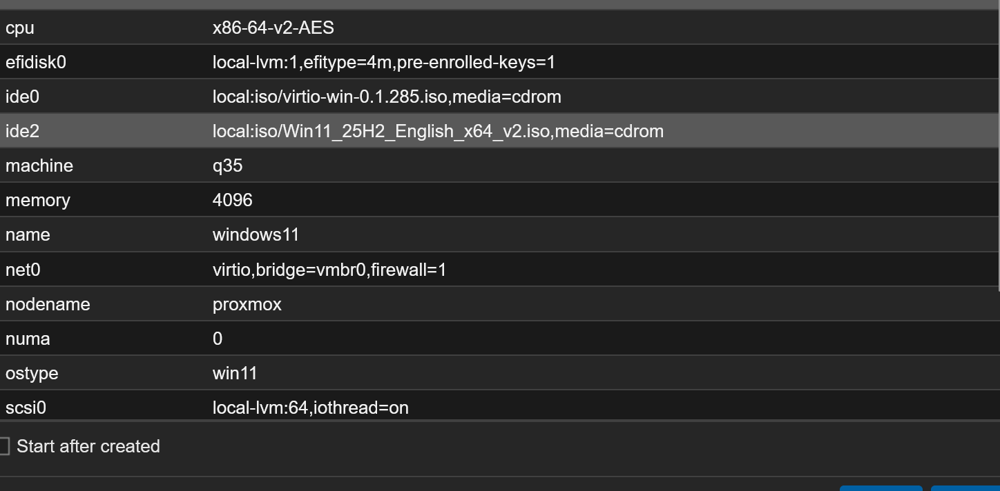

## Goal

Build a general-purpose Windows 11 practice/learning VM — not intended as a daily-use machine — to practice Windows administration, later repurposed as the client machine for the Active Directory project.

## Specs

q35 machine, OVMF (UEFI) BIOS, TPM v2.0, VirtIO SCSI disk (64GB), VirtIO NIC, 4096MB RAM, 2 cores.

*Final hardware config before first boot.*

## Build

- Downloaded the Windows 11 ISO and the VirtIO driver ISO, uploaded both to Proxmox local storage
- Loaded the VirtIO SCSI driver during Windows Setup so the installer could see the virtual disk at all
- Attached the VirtIO ISO as a second CD drive so the NetKVM network driver could be loaded during OOBE — the network adapter wasn't recognized by default
- Signed into a dedicated Microsoft account (separate from personal accounts) that the original hardware's Windows OEM digital license had been linked to
- Opted to restore a "Homelab" Windows Backup during setup (folders/apps/settings/credentials previously synced from the original bare-metal install on this hardware) — Windows Backup only restores specific known folders (Desktop/Documents/Pictures/Videos) and limited apps, not a full system state, so not everything from the old install came back
- Post-install cleanup: installed QEMU Guest Agent, detached both installer ISOs, took a snapshot of the clean install state, shut down cleanly via Proxmox's Shutdown button (guest agent enables graceful shutdown vs. a hard Stop)

## Activation

Activation did not succeed automatically (error `0xC004F213`) — the OEM digital license is tied to a hardware fingerprint, and this VM's virtual hardware doesn't match the original physical machine's. Left unactivated since this is a practice VM, not production. Full reasoning and screenshots: [Windows Practice VM - Left Unactivated](../Decisions/Windows%20Practice%20VM%20-%20Left%20Unactivated.md).

## Later Usage

- **2026-07-13** — joined the Tailscale tailnet (`100.76.5.113`) as part of the [Tailscale](Tailscale.md) project
- **2026-08-27** — domain-joined to `mujtaba.internal` as the client machine for the [Active Directory](Active%20Directory.md) project; confirmed live enforcement of a Group Policy while logged in as a domain user

## Status

Running, unactivated (accepted trade-off for a practice VM), joined to the tailnet, and domain-joined to `mujtaba.internal`.

## Related Decisions

- [Windows Practice VM - Left Unactivated](../Decisions/Windows%20Practice%20VM%20-%20Left%20Unactivated.md)

## Project Log

### 2026-07-12

- Built the VM, loaded VirtIO drivers, restored partial backup, hit and accepted the activation limitation

### 2026-07-13

- Joined the Tailscale tailnet — see [Tailscale](Tailscale.md)

### 2026-08-27

- Domain-joined to `mujtaba.internal` — see [Active Directory](Active%20Directory.md)

## Next Steps

None currently — serving its role as the AD project's client machine.
