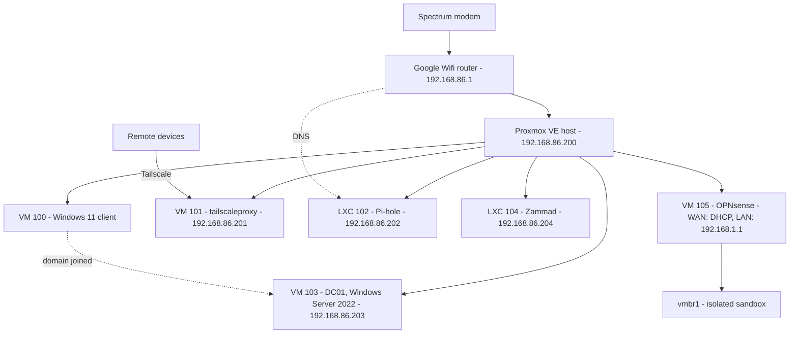

# Homelab

A personal homelab built for hands-on IT infrastructure practice — sysadmin, networking, and security fundamentals — documented as it's built, mistakes and all.

Everything here runs on a single physical box, virtualized with Proxmox. Each project below started from an actual need or learning goal, not a scripted tutorial, and the documentation reflects that: decisions made along the way, problems actually hit, and how they got fixed.

## Hardware

- Lenovo ThinkCentre M720q — Intel i5-8400T, 16GB RAM, 500GB SSD
- Proxmox VE 9.2 as the hypervisor

## Architecture

Everything runs on one Proxmox host behind a Google Wifi router. Pi-hole is the network's DNS server, and Tailscale provides remote access.

Per-guest specs and build history are in [Proxmox](Projects/Proxmox.md).

## Projects

| Project | What it does | Status |
|---|---|---|
| **Active Directory** | Single-domain AD forest (`mujtaba.internal`) — domain controller, OU/security group structure, Group Policy enforcement, bulk user provisioning, file server with role-based NTFS permissions, and GPO software deployment, plus a least-privilege delegated helpdesk account, all verified against a real domain-joined client | Complete |
| **Pi-hole** | Network-wide DNS-based ad blocking, covering the whole home LAN and remote devices via Tailscale | Complete |
| **Tailscale** | Remote access to the whole home network (subnet router) plus an exit node for sharing the home IP with specific outside devices | Complete |
| **Zammad** | Helpdesk/ticketing system (LXC) modeled on the AD domain's departments, connected to AD through a delegated, password-reset-only technician account and tested with an end-to-end ticket workflow, including a negative permission test | Complete |
| **OPNsense Segmentation Lab** | Isolated virtual sandbox inside Proxmox for practicing network segmentation: an open source firewall (OPNsense) separating VLAN-based groups of guests, with default-deny rules proven by a failed cross-VLAN ping and a narrow HTTP-only allow rule proven by a passing curl and a still-failing ping | Complete |

Full build detail, the reasoning behind specific choices, and every issue hit along the way live in this vault — see **How This Vault Is Organized** below.

## How This Vault Is Organized

This repo doubles as a running engineering journal, not just a project showcase. Four folders, each with one job:

- **[Projects/](Projects/)** — one file per system. Start here for the current state of anything: what exists, its status, and links out to the detail behind it.
- **[Daily Logs/](Daily%20Logs/)** — a dated log of what actually happened in each work session. See the [index](Daily%20Logs/README.md) for the most recent entries first.
- **[Decisions/](Decisions/)** — one file per meaningful choice, written as *what was chosen over what, and why* — not just a settings dump. See the [index](Decisions/README.md) grouped by project.
- **[Troubleshooting/](Troubleshooting/)** — one file per real problem hit, in Symptom → Diagnosis → Root Cause → Fix format. Nothing here is hypothetical; everything was actually encountered. See the [index](Troubleshooting/README.md) grouped by project.

The goal of splitting it this way: a project file gives you the current picture in 30 seconds, while the Decisions and Troubleshooting folders let anyone curious dig into *why* something is built the way it is, without wading through unrelated project history to find it.

## About

Built by Mujtaba, a Management Information Systems student, as a portfolio project while exploring sysadmin, networking, and security as a career direction. More projects are added as time allows — check [Projects/](Projects/) for the current lineup.
